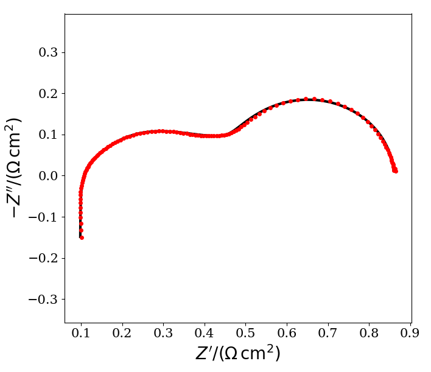
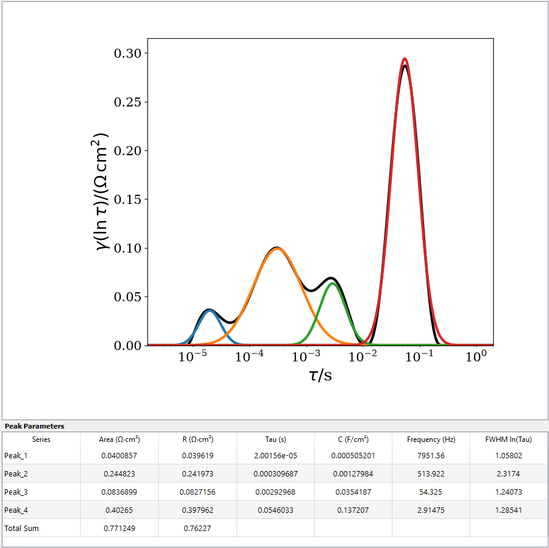

# pyDRT Peak Analysis

An integrated Python GUI for EIS data import, Distribution of Relaxation Times (DRT) analysis, peak deconvolution, and automated extraction of peak parameters.
This repository provides an extended and modified version of pyDRTtools in which data conversion, DRT analysis, peak analysis, and parameter export are integrated into a single GUI.

  

  Nyquist plot.

  

  DRT peaks.

## Main Features

- Direct import of EIS data exported from different instruments, including Solartron, Autolab, Gamry, and Zahner.
- Automatic conversion and standardization of imported EIS files for use in pyDRTtools.
- Optional active-area correction for impedance data reported in Ω.
- Direct use of data already normalized in Ω·cm² without additional area correction.
- DRT calculation and visualization within the same GUI.
- Peak deconvolution directly from the DRT curve.
- Automated extraction of the following parameters for each DRT peak:
  - Polarization resistance (R)
  - Capacitance
  - Relaxation time (τ)
  - Peak frequency
  - FWHM (Full Width at Half Maximum)
- Automatic export of the peak parameters to a CSV file.
- Automatic saving of the resulting figure.
- Standalone Windows executable available; no Python or MATLAB installation or additional configuration required.

## Original pyDRTtools

This software is based on and extends the original **pyDRTtools** Python toolbox developed by the Ciucci Lab.

Original pyDRTtools repository:
https://github.com/ciuccislab/pyDRTtools

pyDRTtools is distributed under the MIT License.

Users are encouraged to cite the primary DRTtools/pyDRTtools reference:

T. H. Wan, M. Saccoccio, C. Chen, and F. Ciucci,
“Influence of the discretization methods on the distribution of relaxation times deconvolution: implementing radial basis functions with DRTtools,”
*Electrochimica Acta*, vol. 184, pp. 483–499, 2015.

https://doi.org/10.1016/j.electacta.2015.09.097

## Contact and Citation

Developed and modified by:

**Masood Fakouri Hasanabadi**  
Email: [fakourih@ualberta.ca](mailto:fakourih@ualberta.ca)

If you use this software in your research, please cite this GitHub repository using the **“Cite this repository”** option available on GitHub:

https://github.com/MFakouri/pyDRT-Peak-Analysis-

Please cite the software in any publications or presentations in which it is used.
Users should also cite the original pyDRTtools/DRTtools publication listed above when appropriate.
